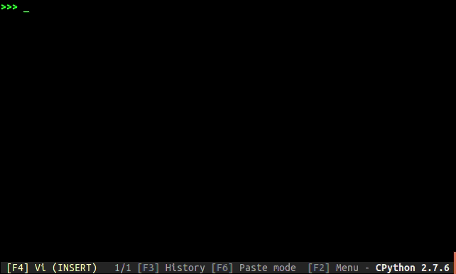

## 制作进度条

既然接手了国内专有云，就要写一个“自动化部署脚本”。于是我就把整个部署的安装包放到阿里云的bucket，用脚本去`wget`这个部署包，然后进行脚本部署。但是由于这个安装包比较大，`于是就打算在脚本里添加一个“下载进度条”，这样就能了解到当前的下载情况。

google了一下，就发现了`tqdm`这个库，它声称比老版的progressbar库的单次响应时间提高了10倍以上，安装的方法很简单：`pip install tqdm`。

具体的用途和参数可以去看<https://lorexxar.cn/2016/07/21/python-tqdm/> 这篇文章。

从tqdm的几个参数可见要使用tqdm做下载进度条首先需要整个文件的大小。整个文件的大小可以用`requests.get`方法获取，获取到`header`里就有目标的大小。在使用`requests`模块下载大文件/数据时，建议使用使用`stream`模式。如果是`stream=False`，它会立即开始下载文件并放到内存中，如果文件过大，有可能导致内存不足。然后就是把目标文件拆成一个一个的小块，逐步的写入一个文件，这样达到了下载文件的目的。整个脚本如下：

```python
#!/usr/bin/env python
# -*- coding: utf-8 -*-
import requests
from tqdm import tqdm

def downloadFILE(url,name):
    resp = requests.get(url=url,stream=True)
	#stream=True的作用是仅让响应头被下载，连接保持打开状态，
    content_size = int(resp.headers['Content-Length'])/1024		#确定整个安装包的大小
    with open(name, "wb") as f:
        print "安装包整个大小是：",content_size,'k，开始下载...'
        for data in 	tqdm(iterable=resp.iter_content(1024),total=content_size,unit='k',desc=name):
	#调用iter_content，一块一块的遍历要下载的内容，搭配stream=True，此时才开始真正的下载
	#iterable：可迭代的进度条 total：总的迭代次数 desc：进度条的前缀
            f.write(data)
        print name + "已经下载完毕！"

if __name__ == '__main__':
    url = "需要下载的文件的地址"
    name = url.split('/')[-1]		#截取整个url最后一段即文件名
    downloadFILE(url,name)
```


[](https://rorschachchan.github.io/images/bpython1.png)


注意！下载文件所在的bucket要设置成“公有读”而不能是“私有”。


## 补充

1. 解压缩的脚本：

   ```python
   import zipfile
   filename = '要解压包的路径'
   fz = zipfile.ZipFile(filename, 'r')
   for file in fz.namelist():
       fz.extract(file, path)
   ```

这个脚本即使没有unzip命令也可以执行的。

1. 获取本地IP地址的脚本：

   ```python
   def get_local_ip(ifname = 'eth0'):
       import socket, fcntl, struct
       s = socket.socket(socket.AF_INET, socket.SOCK_DGRAM)
       inet = fcntl.ioctl(s.fileno(), 0x8915, struct.pack('256s', ifname[:15]))
       ret = socket.inet_ntoa(inet[20:24])
       return ret
   
   print get_local_ip()
   ```

2. `bpython`，这是一个好东西，可以在linux环境下实现类似`pycharm`的提示功能,搭配tab键补全。安装方法就是`pip install bpython`，然后启动python的时候直接bpython即可。效果如图：
   []()


```

```


## 参考资料

<https://blog.csdn.net/qq_40666028/article/details/79335961>
<http://blog.topspeedsnail.com/archives/9075>
<https://www.168seo.cn/python/24286.html>